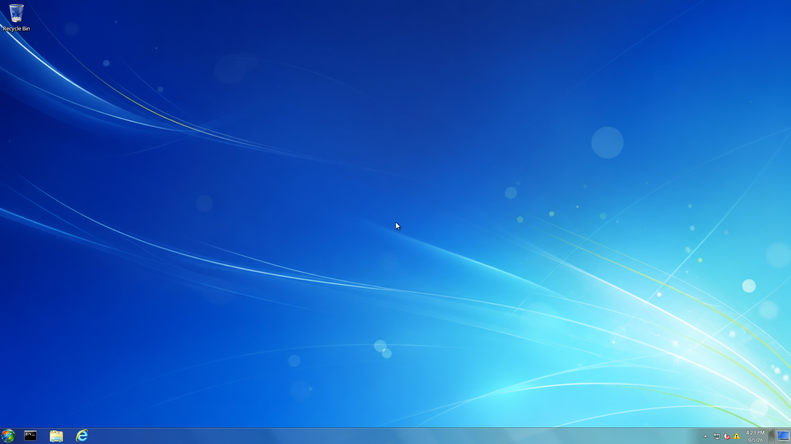
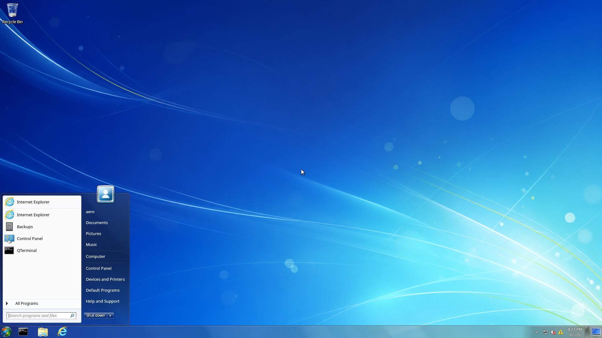
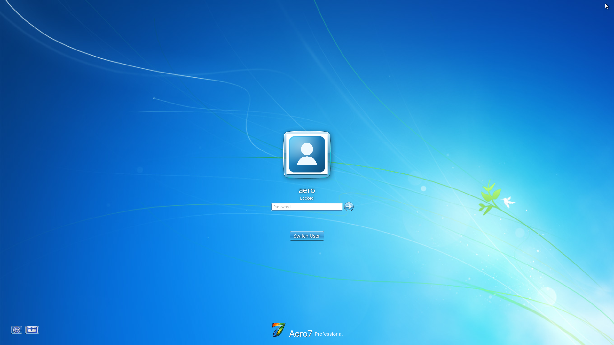
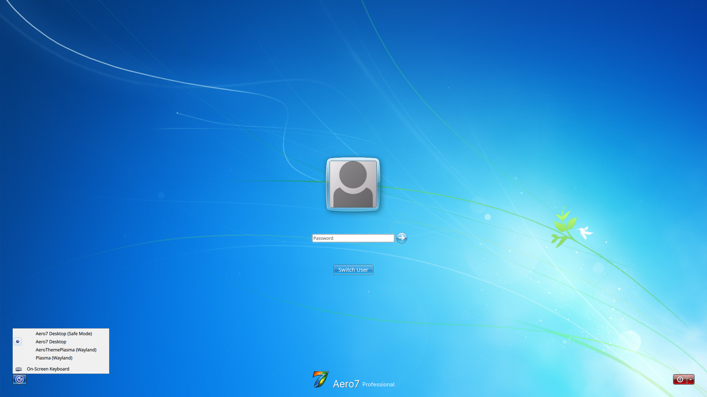
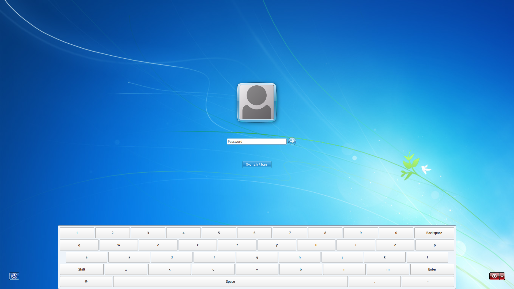

# Aero7 Desktop — 1920×1080 Screenshot Tour

Captured on **5 September 2026** from a real QEMU/KVM guest at **1920×1080,
100% scale**. The PNGs are original framebuffer captures, not cropped,
upscaled, retouched, or generated artwork.

This is an updated existing test VM, not a fresh final Beta 2 ISO install.
Desktop **0.2.0-25**, Gadgets **3.0.0-1**, browser compatibility **0.1.0-4**,
and AeroTheme desktop **6.7.0_742.r9c2d850-38** were installed. The source and
package recipes can be newer. Read the
[complete capture record](https://github.com/aero7-open-project/aero7/wiki/Screenshot-Capture-Details)
for preparation, versions, checksums, and acceptance limits.

## Desktop and Start

Recycle Bin and the intended Start/Command Prompt/File Explorer/browser
taskbar order. Gadgets were stopped for this view; it is not an untouched
fresh-account test. [First Login and Defaults](First-Login-and-Defaults)
explains factory layout versus preserved personal settings.

The existing profile still shows duplicate Internet Explorer entries and
QTerminal wording. These visible differences are recorded, not passed off as
the final factory layout.

## Desktop Gadgets

Eight built-ins on page one, with Media Center on page two. Some thumbnail
text is clipped in this older package. See [Desktop Gadgets](Desktop-Gadgets)
for all nine gadgets, real data sources, persistence, and network limits.

## Lock screen

The full logo is visible at 1080p. This is a locked existing session, not SDDM.
It does not establish correctness at every scale or on every physical GPU.

## Login and session selection

The installed Aero7 SDDM theme was explicitly selected in the disposable VM.
The logo is complete; the saved account's blank display-name area is a
remaining observation, not a removed or retouched label.

Normal Aero7, Safe Mode, AeroThemePlasma, and Plasma are installed choices.
The menu includes On-Screen Keyboard, not the full Windows pre-login
accessibility checkbox dialog.

This documents the keyboard surface, not every layout/authentication path.
See [First Login and Defaults](First-Login-and-Defaults).

## Related views

- [Control Panel, Screen Resolution, and Optional Features](https://github.com/aero7-open-project/aero7-control-panel-/wiki/Screenshots)
- [Explorer, Computer, Libraries, and Library Properties](https://github.com/aero7-open-project/aero7-file-explorer/wiki/Screenshots)
- [Full Aero7 gallery](https://github.com/aero7-open-project/aero7/wiki/Screenshot-Gallery)
- [Capture SHA-256 checksums](images/beta2-1080p/SHA256SUMS.txt)

These images do not certify fresh/offline installation, file-operation
recovery, suspend/resume, or multi-monitor hardware. [Known Issues](Known-Issues)
keeps those boundaries separate.
